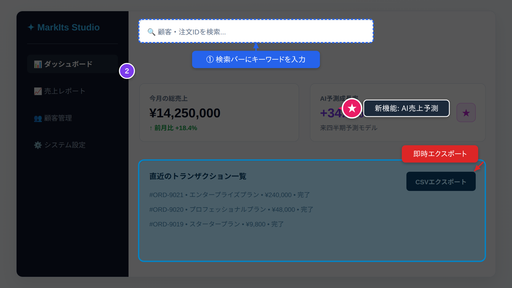
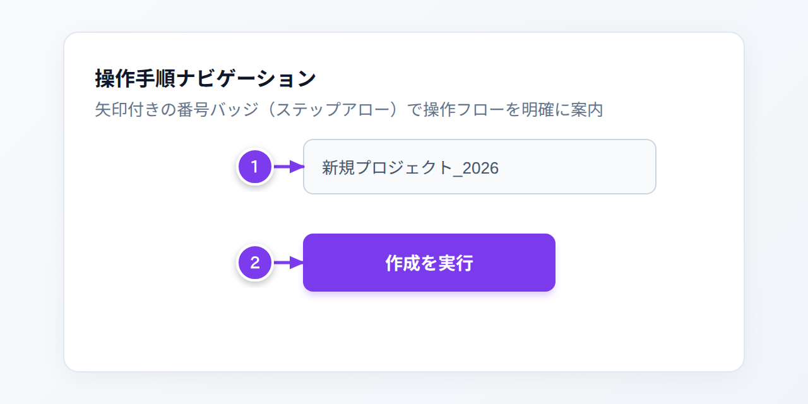
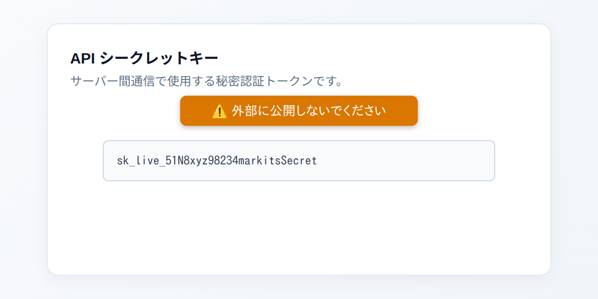
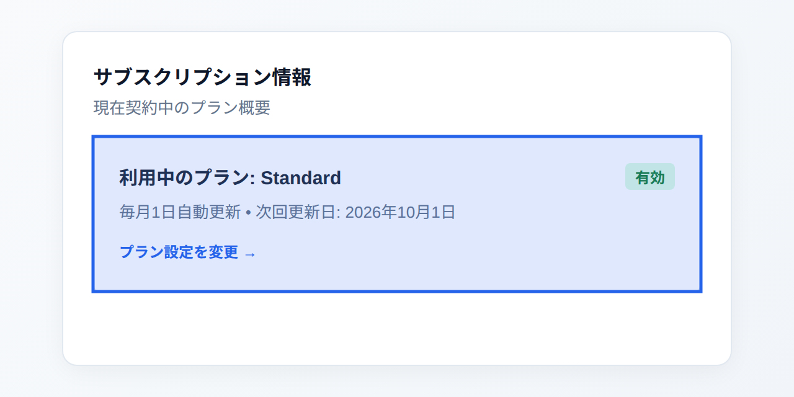
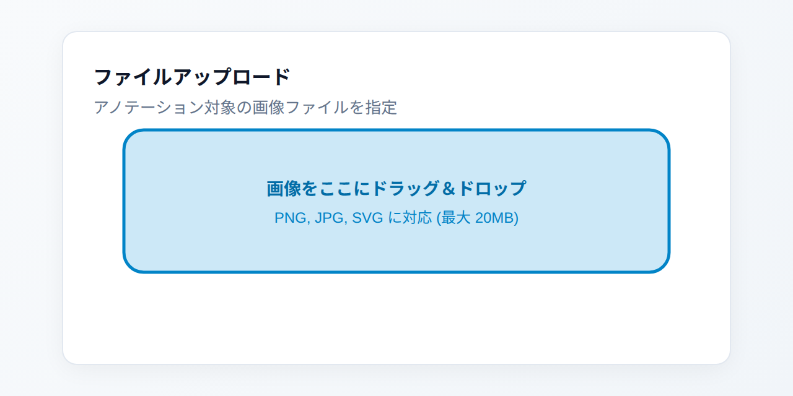
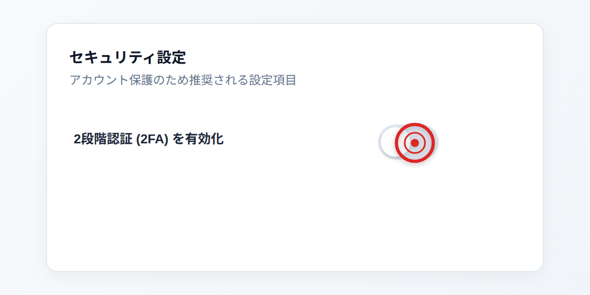
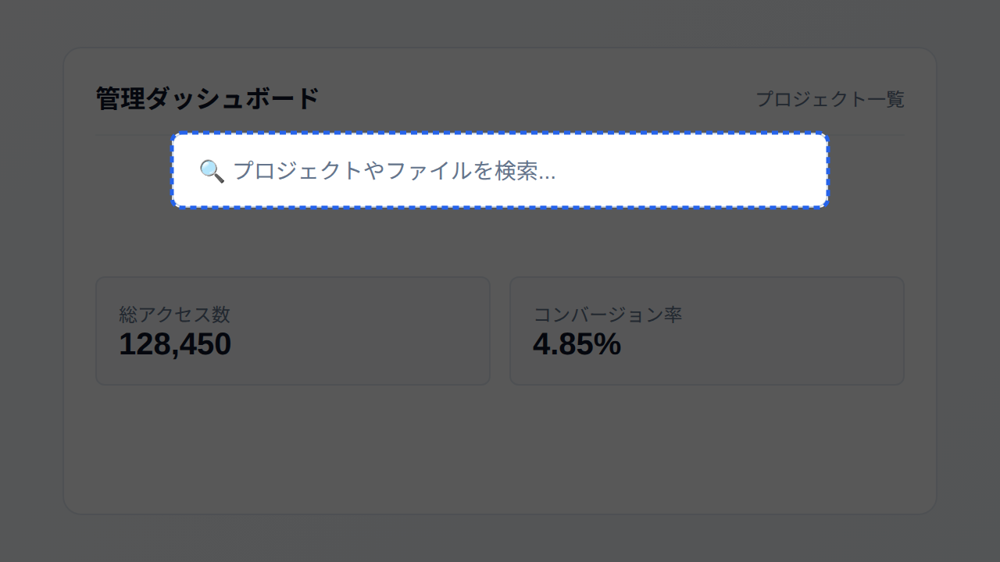
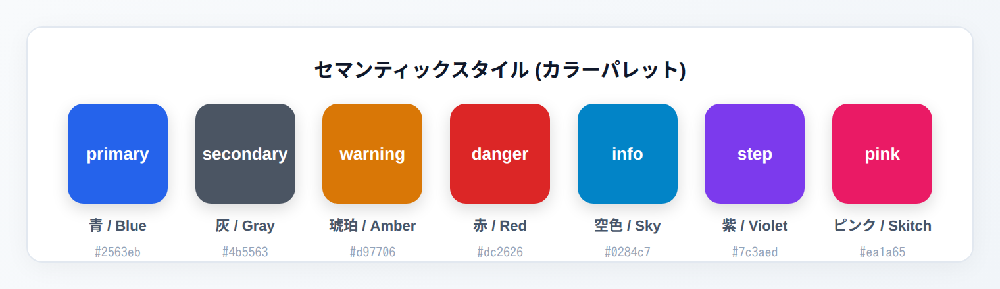

# MarkIts — Semantic Annotation SVG Engine

**MarkIts** は、スクリーンショットや画像の上に重ねる説明用アノテーションを、意味的な指示（Semantic JSON）から高品質な **SVG** として生成する軽量な Rust ライブラリおよび CLI ツールです。

> **「AIは『何を説明するか』を決め、MarkItsは『どう綺麗に見せるか』を決める」**

<p align="center">
  
</p>

---

## 🔖 対応マーク（アノテーション）一覧 & スクリーンショット

MarkIts で利用可能な全 13 種類のマーク（アノテーション）の一覧です。UI 上の対象要素（`target`）に合わせて自動レイアウトされ、視認性の高いアノテーション SVG を出力します。

### マーククイック一覧表

| マーク種別 (`type`) | 概要 / 主な用途 | 主なオプション |
| :--- | :--- | :--- |
| [`callout`](#1-callout-コールアウト) | テキストピル＋自動ルーティング引出線矢印 | `text`, `style`, `position`, `outline`, `shadow` |
| [`pin`](#2-pin-ピンタグ--skitch-スタイル) | アイコン入りピンヘッド＋三角ポインター＋連結テキスト（Skitch風） | `icon`, `text`, `style`, `position`, `outline`, `shadow` |
| [`badge`](#3-badge-ステップバッジ) | 操作手順番号やステップを示す円形バッジ | `step`, `text`, `style`, `position`, `shadow` |
| [`step-arrow`](#4-step-arrow-矢印つき番号--ステップアロー) | 矢印で対象を指し示す番号バッジ（手順案内向け） | `step`, `text`, `style`, `position`, `shadow` |
| [`label`](#5-label-テキストラベル) | フチ取り（アウトライン）対応の高視認性テキストピル | `text`, `style`, `position`, `outline`, `shadow` |
| [`rect`](#6-rect-矩形ハイライト) | 領域を半透明カラーと枠線で囲む矩形ハイライト | `style`, `shadow` |
| [`rounded-rect`](#7-rounded-rect-角丸矩形ハイライト) | 角丸の丸みを自在に調整できるハイライト枠 | `rx`, `ry`, `style`, `shadow` |
| [`circle`](#8-circle--ellipse-円形楕円ハイライト) | アバターや丸型アイコン・ボタンを囲む円形・楕円ハイライト | `style`, `shadow` |
| [`arrow`](#9-arrow-ポインター矢印) | 注目対象をダイレクトに指し示す方向指示矢印 | `position`, `style`, `shadow` |
| [`bezier-arrow`](#10-bezier-arrow-ベジェ矢印--曲線コネクタ) | 始点・中間点・終点を結ぶ曲線矢印。中間にテキスト配置対応（枠あり・枠なし・離れ距離調整対応） | `start`, `control`, `end`, `text`, `box`, `offset`, `position`, `style`, `shadow`, `outline` |
| [`bullseye`](#11-bullseye-ブルズアイ--注目点マーカー) | クリック位置や注目箇所を精密に示す同心円マーカー | `style`, `shadow` |
| [`divider`](#12-divider-区切り線--セパレーター) | 画面セクションや手順フェーズを視覚的に分ける区切り線 | `style` |
| [`spotlight`](#13-spotlight-スポットライト) | 画面全体を暗転させ、対象領域のみをくり抜いてフォーカス | `style` |

---

### 各マークの詳細仕様 & JSON 例

#### 1. `callout` (コールアウト)
ターゲット要素（ボタンや入力欄など）を自動で指し示す矢印と、説明文を入れたテキストピルを同時に生成します。8方向の候補からキャンバスはみ出しや他要素との重複を避ける決定論的自動レイアウトが行われます。


```json
{
  "type": "callout",
  "target": [220, 115, 200, 48],
  "text": "① 保存ボタンをクリックして変更を反映",
  "style": "primary",
  "position": "bottom",
  "outline": false,
  "shadow": true
}
```

- **主なプロパティ**:
  - `target` *(必須)*: 対象領域 `[x, y, width, height]` または `{"x": 220, "y": 115, "width": 200, "height": 48}`
  - `text` *(必須)*: 表示する説明テキスト
  - `style`: セマンティックスタイル（デフォルト: `"primary"`）
  - `position`: 配置優先ヒント（`"auto"`, `"top"`, `"bottom"`, `"left"`, `"right"`, `"top-left"`, `"top-right"`, `"bottom-left"`, `"bottom-right"`）
  - `outline`: 白フチ文字（`true` / `false`）
  - `shadow`: ドロップシャドウ（`true` / `false`）

---

#### 2. `pin` (ピンタグ / Skitch スタイル)
記号・文字・絵文字（例: `?`, `♡`, `★`, `1` など）が入る円形ピンヘッド、対象を指す三角ポインター、そして連結されたダーク調のテキストピルで構成される Skitch 風のピンアノテーションです（別名: `pin_callout`, `pin-callout`）。


```json
{
  "type": "pin",
  "target": [260, 130, 48, 48],
  "icon": "♡",
  "text": "お気に入りに追加",
  "style": "pink",
  "position": "right",
  "outline": false
}
```

- **主なプロパティ**:
  - `target` *(必須)*: 対象領域
  - `icon`: ピンヘッド内に表示する記号・アイコン・1文字（省略可）
  - `text`: ピンヘッドに連結するダークピルテキスト（省略時はピンヘッド＋ポインターのみ）
  - `style`: セマンティックスタイル（Skitch マゼンタは `"pink"`）
  - `position`: ピンの配置方向（`"left"`, `"right"`, `"top"`, `"bottom"`）

---

#### 3. `badge` (ステップバッジ)
チュートリアルや操作手順ガイド（①、②、Step 1、Step 2...）に最適な円形の番号マーカーです。ターゲット矩形のコーナーや周囲にオフセット配置されます。


```json
{
  "canvas": { "width": 640, "height": 320 },
  "annotations": [
    {
      "type": "badge",
      "target": [110, 115, 420, 44],
      "step": 1,
      "style": "step",
      "position": "top-left"
    },
    {
      "type": "badge",
      "target": [110, 185, 420, 44],
      "step": 2,
      "style": "step",
      "position": "top-left"
    }
  ]
}
```

- **主なプロパティ**:
  - `target` *(必須)*: 対象領域
  - `step`: 手順番号（数値 `1`, `2`, ...）
  - `text`: 文字列での指定（`step` の代わりに使用可能）
  - `style`: セマンティックスタイル（ステップ推奨: `"step"`）
  - `position`: 配置コーナー（`"top-left"`, `"top-right"`, `"bottom-left"`, `"bottom-right"` など）
  - `arrow`: `true` に設定すると矢印付き番号（`step-arrow`）として描画

---

#### 4. `step-arrow` (矢印つき番号 / ステップアロー)
操作マニュアルやチュートリアルで頻出する、**番号バッジ（①、②、1、2...）から対象要素へ向けて矢印が伸びる**アノテーションです（別名: `number-arrow`, `numbered-arrow`, `arrow-badge`）。適切なオフセットで番号マーカーを自動配置し、対象要素へ直接矢印線を引くため、複数ステップの操作順序が一目で伝わります。



```json
{
  "canvas": { "width": 640, "height": 320 },
  "annotations": [
    {
      "type": "step-arrow",
      "target": [240, 110, 280, 44],
      "step": 1,
      "style": "step",
      "position": "left"
    },
    {
      "type": "step-arrow",
      "target": [240, 185, 200, 46],
      "step": 2,
      "style": "step",
      "position": "left"
    }
  ]
}
```

- **主なプロパティ**:
  - `target` *(必須)*: 対象領域 `[x, y, width, height]`
  - `step`: 手順番号（数値 `1`, `2`, ...）
  - `text`: 任意の文字列（`"①"`, `"A"` など）
  - `style`: セマンティックスタイル（デフォルト: `"step"` または `"primary"`）
  - `position`: バッジの配置方向（`"left"`, `"right"`, `"top"`, `"bottom"`, `"auto"` など）
  - `shadow`: ドロップシャドウ（`true` / `false`）

> [!TIP]
> `type: "step-arrow"` 以外にも、既存の `badge` に `"arrow": true` を指定するか、または `arrow` に `"step": 1` を指定しても自動的に矢印つき番号として描画されます。

---

#### 5. `label` (テキストラベル)
引出線矢印を伴わず、対象領域のすぐそばに直接注釈テキストピルを配置します。`\n` による複数行テキストにも対応しています。



```json
{
  "type": "label",
  "target": [110, 150, 420, 44],
  "text": "⚠️ 外部に公開しないでください",
  "style": "warning",
  "position": "top",
  "outline": false
}
```

- **主なプロパティ**:
  - `target` *(必須)*: 対象領域
  - `text` *(必須)*: 表示テキスト（改行 `\n` 対応）
  - `style`: セマンティックスタイル
  - `position`: 配置方向（`"top"`, `"bottom"`, `"left"`, `"right"` など）
  - `outline`: 白フチ取りの有無

---

#### 6. `rect` (矩形ハイライト)
対象領域を薄い透過色で塗りつぶし、境界線で強調します。テーブルの行、カード、ボタン領域全体のフォーカスに適しています。



```json
{
  "type": "rect",
  "target": [75, 110, 490, 125],
  "style": "primary"
}
```

- **主なプロパティ**:
  - `target` *(必須)*: 対象矩形領域 `[x, y, width, height]`
  - `style`: セマンティックスタイル
  - `shadow`: ドロップシャドウの有無

---

#### 7. `rounded-rect` (角丸矩形ハイライト)
角丸を持つ UI 要素（ドロップゾーン、モーダル、ボタン、タグなど）にぴたりとフィットするハイライト枠です（別名: `rounded_rect`）。`rx`、`ry` で丸み半径を細かく調整できます。



```json
{
  "type": "rounded-rect",
  "target": [100, 105, 440, 115],
  "rx": 16,
  "ry": 16,
  "style": "info"
}
```

- **主なプロパティ**:
  - `target` *(必須)*: 対象領域
  - `rx`: 水平方向の角丸半径（デフォルト: `8.0`）
  - `ry`: 垂直方向の角丸半径（デフォルト: `8.0`）
  - `style`: セマンティックスタイル

---

#### 8. `circle` / `ellipse` (円形・楕円ハイライト)
丸型アバター、アイコンボタン、トグルスイッチ、ラジオボタンなどを囲んで強調します（別名: `ellipse`）。幅と高さの比率に応じて正円または楕円形になります。


```json
{
  "type": "circle",
  "target": [275, 110, 90, 90],
  "style": "danger"
}
```

- **主なプロパティ**:
  - `target` *(必須)*: 対象領域（正円の場合は幅＝高さ）
  - `style`: セマンティックスタイル

---

#### 9. `arrow` (ポインター矢印)
ターゲットの端点に向けてシャープな矢印線を引き、特定の位置やボタンを指し示します。


```json
{
  "type": "arrow",
  "target": [320, 130, 170, 44],
  "position": "bottom-left",
  "style": "danger"
}
```

- **主なプロパティ**:
  - `target` *(必須)*: 対象領域
  - `position`: 矢印の起点方向（`"left"`, `"right"`, `"top"`, `"bottom"`, `"bottom-left"` など）
  - `style`: セマンティックスタイル

---

#### 10. `bezier-arrow` (ベジェ矢印 / 曲線コネクタ)
始点（`start`）、中間制御点（`control`）、終点（`end`）の3点で制御される滑らかな2次ベジェ曲線矢印を描画します（別名: `curved-arrow`, `curved_arrow`, `curve-arrow`, `bezier`）。
**矢印の中間位置（カーブ頂点付近）に説明テキスト（`text`）を配置可能**で、データフローや状態遷移、関連付けの図示に最適です。

- **重なり回避**: デフォルト（`position: "auto"`）では、曲線の外側（上向きカーブなら上部）に適度なクリアランスを空けて自動配置するため、**矢印線とテキストが重なることなく美しく描画**されます。
- **枠あり / 枠なしの選択 (`box`)**:
  - `box: true`（デフォルト）: スタイルカラーの角丸長方形ピル＋白文字
  - `box: false`: 背景の枠（囲い）を描画せず、スタイルカラー文字＋白フチ（`outline: true`）で矢印の上に浮かせて表示

| 枠ありピル (`box: true`) | 枠なしテキスト (`box: false`) |
| :---: | :---: |
|  |  |

```json
{
  "canvas": { "width": 640, "height": 320 },
  "annotations": [
    {
      "type": "bezier-arrow",
      "start": [230, 185],
      "control": [320, 85],
      "end": [410, 185],
      "text": "リアルタイム同期",
      "style": "primary",
      "box": true,
      "position": "auto"
    }
  ]
}
```

- **主なプロパティ**:
  - `start` (`from`, `p0`): 矢印の始点座標 `[x, y]` または `{"x": 230, "y": 185}`
  - `control` (`mid`, `middle`, `via`, `p1`, `intermediate`): 曲線のカーブを制御する中間制御点 `[x, y]`（省略時は始点・終点の中間上方に自動配置）
  - `end` (`to`, `p2`): 矢頭（矢印の先）が向かう終点座標 `[x, y]`
  - `text`: 矢印の中間に表示する説明ラベル（省略可）
  - `offset` (`gap`, `distance`): **矢印とテキストの離れる距離（ピクセル単位）**。数値を指定して自由に離れ具合を調整可能（例: `12`, `16`, `24`。省略時は `box: true` で 8px、`box: false` で 6px）
  - `position`: テキストの配置位置（`"auto"`: カーブ外側に自動配置 / `"top"`: 曲線の上 / `"bottom"`: 曲線の内側・下 / `"center"`: 曲線直上）
  - `box` (`boxed`, `enclosure`, `pill`, `frame`): テキストの背景枠・囲いの有無（`true`: 枠あり角丸ピル / `false`: 枠なし浮動テキスト、デフォルト: `true`）
  - `t` (`ratio`, `progress`): 曲線上の配置比率（`0.0` 〜 `1.0`、デフォルト: `0.5` 中央）
  - `style`: セマンティックスタイル（デフォルト: `"primary"`）
  - `shadow`: ドロップシャドウ（`true` / `false`、デフォルト: `true`）
  - `outline`: 白フチ取り（`true` / `false`、デフォルト: `true`）
  - `target`: `start`/`control`/`end` の代わりに矩形 `target` を指定して上部アーチ矢印を自動生成することも可能

---

#### 11. `bullseye` (ブルズアイ / 注目点マーカー)
二重同心円＋中心ドットで構成される精密ターゲットマーカーです。トグルスイッチのつまみ、チェックボックス、アイコンの中心など「ここをクリック」というピンポイントの指定に最適です。



```json
{
  "type": "bullseye",
  "target": [430, 135, 40, 40],
  "style": "danger"
}
```

- **主なプロパティ**:
  - `target` *(必須)*: 中心位置を求めるための対象領域
  - `style`: セマンティックスタイル

---

#### 12. `divider` (区切り線 / セパレーター)
画面を論理的なグループに分けたり、ビフォー・アフターや手順の段階を仕切るためのセパレーターライン（丸端ラインキャップ）を描画します。


```json
{
  "type": "divider",
  "target": [70, 165, 500, 4],
  "style": "danger"
}
```

- **主なプロパティ**:
  - `target` *(必須)*: 水平線は `[x, y, width, thickness]`、垂直線は `[x, y, thickness, height]`
  - `style`: セマンティックスタイル

---

#### 13. `spotlight` (スポットライト)
キャンバス全体に暗色半透明のバックドロップマスク（透過率 65%）を敷き、注目させたい領域だけをくり抜いて点線枠でハイライトします。ユーザーの視線を迷わせずに特定領域へ集中させます。



```json
{
  "type": "spotlight",
  "target": [110, 85, 420, 48],
  "style": "primary"
}
```

- **主なプロパティ**:
  - `target` *(必須)*: くり抜く対象領域
  - `style`: くり抜き枠の点線カラーを決めるセマンティックスタイル

---

## 🎨 セマンティックスタイル (カラーパレット)

MarkIts では、色コードを直接指定する代わりに、デザインシステムに基づいた 7 つの「意味的（セマンティック）スタイル」を指定します。

<p align="center">
  
</p>

| スタイル名 | カラーコード | 意味・おすすめ用途 |
| :--- | :--- | :--- |
| `primary` | `#2563eb` (Blue-600) | 標準のアノテーション、主要アクション、メイン情報 |
| `secondary` | `#4b5563` (Gray-600) | 補足情報、副次的な説明、控えめな区切り線 |
| `warning` | `#d97706` (Amber-600) | 注意喚起、必須入力の漏れ、推奨事項 |
| `danger` | `#dc2626` (Red-600) | 警告、削除操作、重要な注目点、クリティカルな操作 |
| `info` | `#0284c7` (Sky-600) | ヒント、参考情報、新機能の案内 |
| `step` | `#7c3aed` (Violet-600) | 手順ガイド、ステップ番号、ワークフロー番号 |
| `pink` | `#ea1a65` (Skitch Magenta) | アイコンピン、お気に入り、目を引くワンポイント注釈 |

---

## 📐 座標指定 (`target`) & 配置ヒント (`position`)

### 座標指定 (`target`)
アノテーションが指し示す対象領域は、以下のいずれのフォーマットでも記述可能です：

1. **4 要素配列形式**（シンプルで推奨）：
   ```json
   "target": [100, 150, 240, 50]
   // [x, y, width, height]
   ```
2. **オブジェクト形式**（キー指定）：
   ```json
   "target": { "x": 100, "y": 150, "width": 240, "height": 50 }
   // または省略形 {"x": 100, "y": 150, "w": 240, "h": 50}
   ```

### 配置優先ヒント (`position`)
`callout`, `pin`, `badge`, `step-arrow`, `label`, `arrow` で指定可能です：
- `"auto"`: レイアウトエンジンがキャンバス境界や他要素との衝突を計算して最適な位置を自動決定
- `"top"`, `"bottom"`, `"left"`, `"right"`: 上下左右の各方向を優先
- `"top-left"`, `"top-right"`, `"bottom-left"`, `"bottom-right"`: コーナー位置を優先（`badge` や斜め矢印で有効）

---

## 主な特徴

- 🎯 **決定論的自動レイアウト**: ターゲット矩形の周囲8方向への候補生成、キャンバスはみ出し防止、衝突回避、矢印ルーティング
- 📐 **多様なアノテーション種別**: コールアウト、ピン、バッジ、矢印付き番号（ステップアロー）、各種図形、矢印、ブルズアイ、区切り線、スポットライト
- 🎨 **セマンティックスタイル & テーマ**: `primary`, `secondary`, `warning`, `danger`, `info`, `step`, `pink`
- 🔲 **視覚効果オプション**: 白フチ（`outline: true`）、ドロップシャドウの有無（`shadow: true / false`）のグローバルおよび要素別切り替え
- ⚡ **Pure Rust**: C依存関係ゼロで高速・クロスプラットフォーム

---

## インストール & CLI 利用方法

### ビルド済みバイナリのダウンロード
[GitHub Releases](https://github.com/tamon-ishii/markits/releases) より、各 OS 向けの最適化済み実行可能バイナリをダウンロードしてそのまま利用できます：
- **Linux**: `x86_64` (glibc / musl static), `aarch64` (ARM64)
- **macOS**: `universal` (Apple Silicon & Intel 両対応), `aarch64` (M1/M2/M3/M4), `x86_64` (Intel)
- **Windows**: `x86_64`

### ソースコードからのビルド
```bash
cargo build --release
```

### コマンドラインからのレンダリング
```bash
# JSON ファイルから SVG を生成して標準出力
markits render input.json > overlay.svg

# パイプ (stdin) 経由で生成
cat input.json | markits render - > overlay.svg
```

---

## 入力 JSON 例 (Semantic Intent)

```json
{
  "canvas": {
    "width": 1200,
    "height": 750
  },
  "shadow": true,
  "annotations": [
    {
      "type": "divider",
      "target": [50, 310, 900, 4],
      "style": "danger"
    },
    {
      "type": "step-arrow",
      "target": [80, 80, 320, 140],
      "step": 1,
      "style": "step",
      "position": "left"
    },
    {
      "type": "pin",
      "target": [440, 140, 60, 60],
      "icon": "?",
      "text": "これは何？",
      "style": "info",
      "position": "right",
      "outline": true
    },
    {
      "type": "bullseye",
      "target": [470, 360, 50, 50],
      "style": "danger"
    },
    {
      "type": "callout",
      "target": [80, 80, 320, 140],
      "text": "検索フィールドをクリック",
      "style": "primary",
      "position": "bottom"
    }
  ]
}
```

---

## Rust ライブラリとしての利用

```rust
use markits::{render_from_json, Scene};

fn main() -> Result<(), Box<dyn std::error::Error>> {
    let json_data = r#"{
        "canvas": { "width": 800, "height": 600 },
        "annotations": [
            {
                "type": "step-arrow",
                "target": [100, 100, 200, 50],
                "step": 1,
                "style": "step",
                "position": "left"
            }
        ]
    }"#;

    // 直接 JSON 文字列から SVG を出力
    let svg = render_from_json(json_data)?;
    println!("{}", svg);

    Ok(())
}
```

---

## ライセンス

MIT
